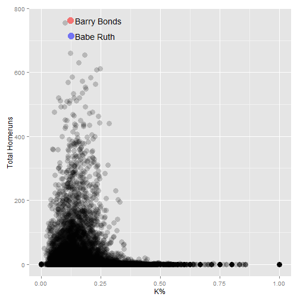

Is strikeout rate associated with player's homerun hitting ability?
========================================================
author: Yosuke Ishizaka, Course Project for Developing Data Products
date: 9/25/2015

Overview
========================================================
The App is built with Shiny and uses Batting and Master dataset from the "Lahman" library.  For information on Lahman database, you're encouraged to read the documentation from http://seanlahman.com/files/database/readme2014.txt

With the App, users can
- Observe general relationship between strikeout rate and homerun total for every MLB player
- Compare strikeout rate and homerun total of 2 top 100 homerun hitter in history
- Compare players graphically in a scatter plot

Preprocessing the Data
========================================================
There are 18,354 player records in Master data set.  Master and Batting data sets are joined by playerID variable.  Variables nameFirst and nameLast from Master are used to create a new variable to show full names.  From Batting data set, playerID, HR, and SO are retained.  Plate appearances variable is created to calculate the strikeout rate.

When users select from top 100 homerun hitters in Select Box, table will show the full name of a player, homerun totals, strikeout totals, plate appearances, and strikeout rate.

```
Source: local data frame [3 x 5]

   playerName  HR   SO    PA     KRate
1 Barry Bonds 762 1539 12606 0.1220847
2  Hank Aaron 755 1383 13940 0.0992109
3   Babe Ruth 714 1330 10616 0.1252826
```

Plotting the Data
========================================================
The App uses ggplot2 scatter plots (geom_point) to present data.  Users can input player 1 and/or player 2 from the drop-down Select Boxes.  Red dot on the plot shows player 1 and blue dot shows player 2 so that users can easily view the association between strikeout rates and homerun totals.
 

The Shiny App
========================================================
Users can visit the following link to try the App:
https://zak81.shinyapps.io/shinyapp-coursera-project-final

The supporting documentation and the project files are avaiable on Github:
